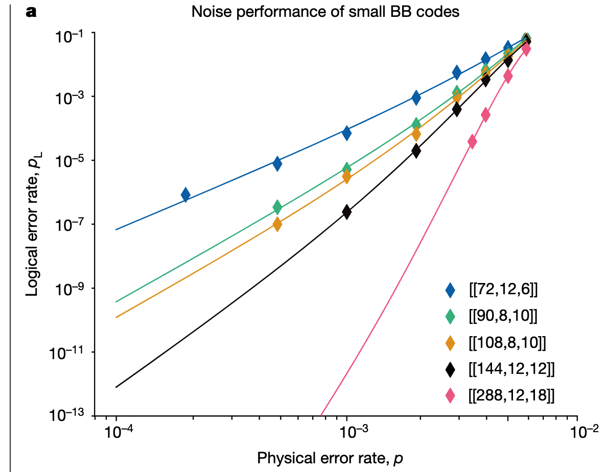
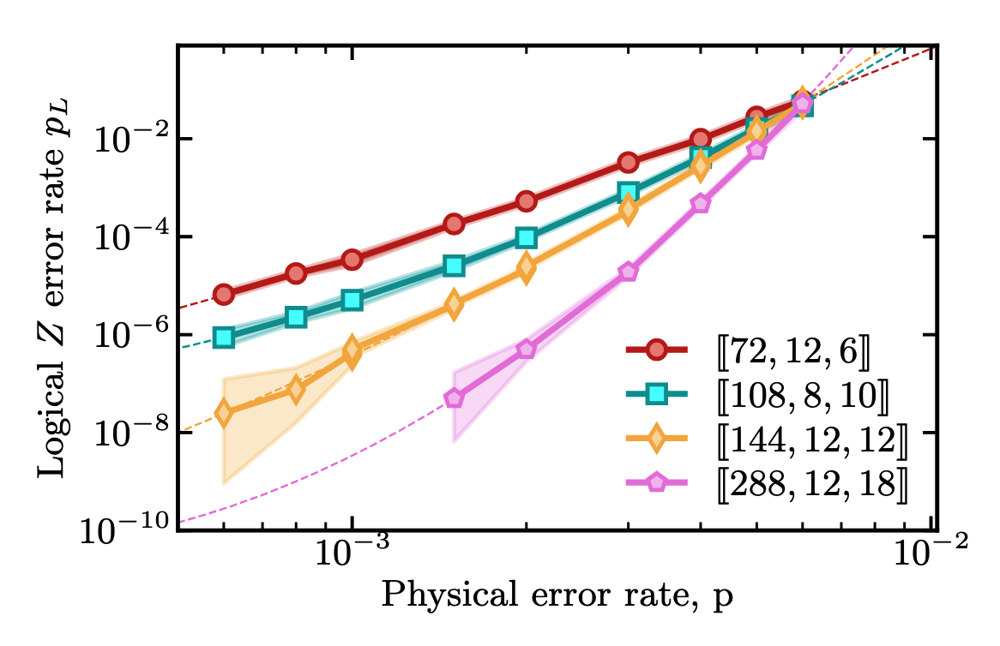

# BB Code GNN-RNN Decoder Architecture

## Code family: Bivariate Bicycle (BB) LDPC codes

Defined by two polynomials A, B over the group algebra of Z_l × Z_m:

```
A = x^{a1} + y^{a2} + y^{a3},   B = y^{b1} + x^{b2} + x^{b3}
hx = [A | B],   hz = [B^T | A^T]
```

Each stabilizer check has weight 6. Each data qubit participates in 6 checks.
The syndrome circuit has depth 8 (7 CNOT rounds + 1 measurement round).

### Supported code sizes

| n   | k  | d  | l  | m  | A             | B             |
|-----|----|----|----|----|---------------|---------------|
| 72  | 12 | 6  | 6  | 6  | x³+y+y²       | y+y²+x³       |
| 90  | 8  | 10 | 15 | 3  | x⁹+y+y²       | x²+x⁷+y⁰     |
| 108 | 8  | 10 | 9  | 6  | x³+y+y²       | y+y²+x³       |
| 144 | 12 | 12 | 12 | 6  | x³+y+y²       | y+y²+x³       |
| 288 | 12 | 18 | 12 | 12 | x³+y²+y⁷      | y+y²+x³       |

### Key reference
`paper/2308.07915v2.pdf` — Bravyi et al., Nature 2024.

---

## Per-round graph construction

Unlike surface codes (which have natural 2D detector coordinates), BB code
stabilizers live on a torus Z_l × Z_m with non-local connectivity. The graph
structure is derived from the Tanner graph (code parity-check matrix), not
from Euclidean distance.

### Detectors per syndrome cycle

With `z_basis=True, use_both=True` (implemented in `src/bb_codes/build_circuit.py`):
- Round 0 of GRU: n/2 Z-check firings (first actual syndrome round)
- Rounds 1..t-1: n/2 Z-check + n/2 X-check firings
- Round t (virtual): n/2 "perfect final Z syndromes" from data qubit measurement

### Sliding window

Each detection event at syndrome round r is replicated into `dt` consecutive
GRU chunks: chunk j = r − d for d ∈ {0, …, dt−1}, provided 0 ≤ j < g_max.
This gives the GRU a local temporal context of dt rounds per step, identical
to the surface code decoder. GRU sequence length: `g_max = t − dt + 2`.

### Node features: [type, coord_x, coord_y, t_local_norm]

- `type`: 0 for Z-check, 1 for X-check
- `coord_x = (i // m − (l−1)/2) / ((l−1)/2)` — normalized torus row
- `coord_y = (i % m  − (m−1)/2) / ((m−1)/2)` — normalized torus column
- `t_local_norm = d / max(dt − 1, 1)` — position within the sliding window, normalised to [0, 1]

where i ∈ {0, …, n/2−1} for both Z- and X-checks (same torus position).

### Edge construction

**Pre-computed distance matrix** (`src/bb_codes/utils.py`):
```python
adj = get_adjacency_matr_from_check_matrices(code.hz, code.hx, 6)
# adj[i, j] = shortest-path distance between checks i and j
#             in the graph where checks sharing a data qubit are neighbors
```

Shape: `(n, n)` where indices 0..n/2−1 = Z-checks, n/2..n−1 = X-checks.

**Per-round graph**: fully connected among all active detectors in the round.
Edge weight = `1 / dist²` (same convention as the surface code decoder).

Because the BB code stabilizers have non-local connections through the torus,
the Tanner graph distance between two checks can be small even if their
torus coordinates differ significantly. The fully-connected graph ensures the
GNN can propagate information across the entire code in a single message-passing
step (unlike surface codes where most edges are local).

---

## Model: BBGRUDecoder (`src/bb_gru_decoder.py`)

Same backbone as `GRUDecoder` for surface codes, adapted for BB codes:

```
Per-round sparse GNN
  x ∈ R^{N × 4}  (active detectors, node features)
  edge_index, edge_attr  (fully-connected within chunk, distance-based weights)
  → global_mean_pool
  → embedding ∈ R^{embed_dim}    (or empty_embedding if no active detectors)

GRU (n_gru_layers deep)
  sequence: [embed_0, ..., embed_{g_max-1}]  ∈ R^{g_max × embed_dim}
  → final hidden state h ∈ R^{hidden_size}

k MLP decoder heads (one per logical observable)
  h → Linear(hidden_size, decoder_hidden) → ReLU → Linear(decoder_hidden, 1)
  → logits ∈ R^k
  loss = BCEWithLogitsLoss(logits, labels)   labels ∈ {0,1}^k
```

**Trivial shots** (no detectors in any round) receive a sequence of
`empty_embedding` vectors through the GRU — the model learns the appropriate
prediction for a trivial syndrome rather than hard-coding zero logits.

**Accuracy**: fraction of shots where **all k** logical predictions are correct.

### Default hyperparameters (BBArgs)

| Parameter | Default | Notes |
|-----------|---------|-------|
| `embedding_features` | [4, 64, 256] | GNN layers: input_dim=4, output_dim=256 |
| `hidden_size` | 256 | GRU hidden state size |
| `n_gru_layers` | 4 | GRU depth |
| `decoder_hidden_size` | `hidden_size // 4` | MLP head intermediate dim |
| `t` | code distance | Syndrome rounds at training time |
| `dt` | 2 | Sliding window size |
| `batch_size` | 2048 | |
| `n_batches` | 256 | Batches per epoch |
| `lr` | 1e-3 | Initial learning rate |
| `min_lr` | 1e-4 | LR floor (exponential decay 0.95/epoch) |

---

## Training (`scripts/train_bb.py`)

```bash
python scripts/train_bb.py --code_size 72 --t 6 --p 0.001 --epochs 1000
# Multi-p training:
python scripts/train_bb.py --code_size 72 --t 6 --p 0.001 --p_list 0.001 0.002 0.003 --epochs 1000 --wandb
# Resume from checkpoint:
python scripts/train_bb.py --code_size 72 --load <model_name>
# With evaluation at the end (adaptive sampling, up to 10M shots per p):
python scripts/train_bb.py --code_size 72 --t 6 --p_list 0.001 0.002 0.003 --epochs 1000 --test
```

Test results are saved to `models/<name>.pt` (under `"test_results"`) and `logs/<name>.json`.

---

## Reference decoder performance (BP-LSD baseline)

Data: `results/lsd_mu_ibm_72_12_6.csv` — IBM simulation data for BP-LSD at
various LSD orders μ ∈ {0, 4, 8, 16, 32, 64, 128}, p ∈ {6×10⁻⁴, …, 6×10⁻³}.
Plots generated by `results/plot_lsd_mu.py`.

### Per-cycle logical error rate

The figures use the per-cycle definition (cf. IBM paper §Methods, LSD paper Fig. 6):

```
p_L = 1 − (1 − P_L)^(1/t)   ≈ P_L / t   for small P_L
```

where P_L is the total logical failure probability over t syndrome rounds.

### Reference figures from papers

**IBM paper (2308.07915) Fig. 2a** — per-cycle p_L, multiple BB codes, BP decoder:



**LSD paper Fig. 6** — per-cycle logical Z error rate, multiple BB codes, BP+LSD:



### Our plots (generated from `results/plot_lsd_mu.py`)

**[[72,12,6]] — all LSD orders μ, log-log, per-cycle** (cf. IBM Fig. 2a):


**Multi-code comparison at μ=0, log-log, per-cycle** (cf. LSD Fig. 6):


| File | Content |
|------|---------|
| `results_bb/lsd_mu_72_12_6.pdf` | Linear-log: [[72,12,6]] all μ, P_L total |
| `results_bb/lsd_mu_72_12_6_loglog.pdf` | Log-log: [[72,12,6]] all μ, per-cycle p_L |
| `results_bb/lsd_mu_multicode_loglog.pdf` | Log-log: [[72,12,6/108,8,10/144,12,12]] at μ=0, per-cycle p_L |

### Key numbers at p = 0.001, μ = 0

| Code | t | p_L (per cycle) | P_L (total) |
|------|---|-----------------|-------------|
| [[72,12,6]]   | 6  | 4.0×10⁻⁵ | 2.4×10⁻⁴ |
| [[108,8,10]]  | 10 | 5.0×10⁻⁶ | 5.0×10⁻⁵ |
| [[144,12,12]] | 12 | 4.3×10⁻⁷ | 5.1×10⁻⁶ |

### Key observations

- **μ insensitivity**: All LSD orders collapse onto a single curve for [[72,12,6]].
  Higher μ gives no measurable improvement at the accessible p range.
- **Distance scaling**: [[144,12,12]] is ~100× better than [[72,12,6]] per cycle
  at p=0.001 — the dominant factor is code distance, not decoder order.
- **GNN-RNN gap**: BB-2 achieved P_L ≈ 0.61% total over 6 rounds
  (per-cycle ≈ 1.0×10⁻³) — about **25× worse** than BP-LSD (μ=0) at p=0.001.

---

## Old approach (reference only, `src/bb_codes/`)

Previous implementation used a single **flat spacetime graph** (all t rounds
concatenated into one graph), processed by a static GNN with `global_mean_pool`.

Problems:
- Graph size grows as O(n × t): impractical for t >> d
- No temporal inductive bias: GNN must learn temporal relations from spatial position
- Stalled at ~17% P_L (vs. BP-OSD at ~0.02%) on [[72,12,6]] at p=10⁻³

See `src/bb_codes/decoder.py` and `src/bb_codes/gnn_models.py` for the old code.
The training result is in `src/bb_codes/training_72_12_6.pdf`.
